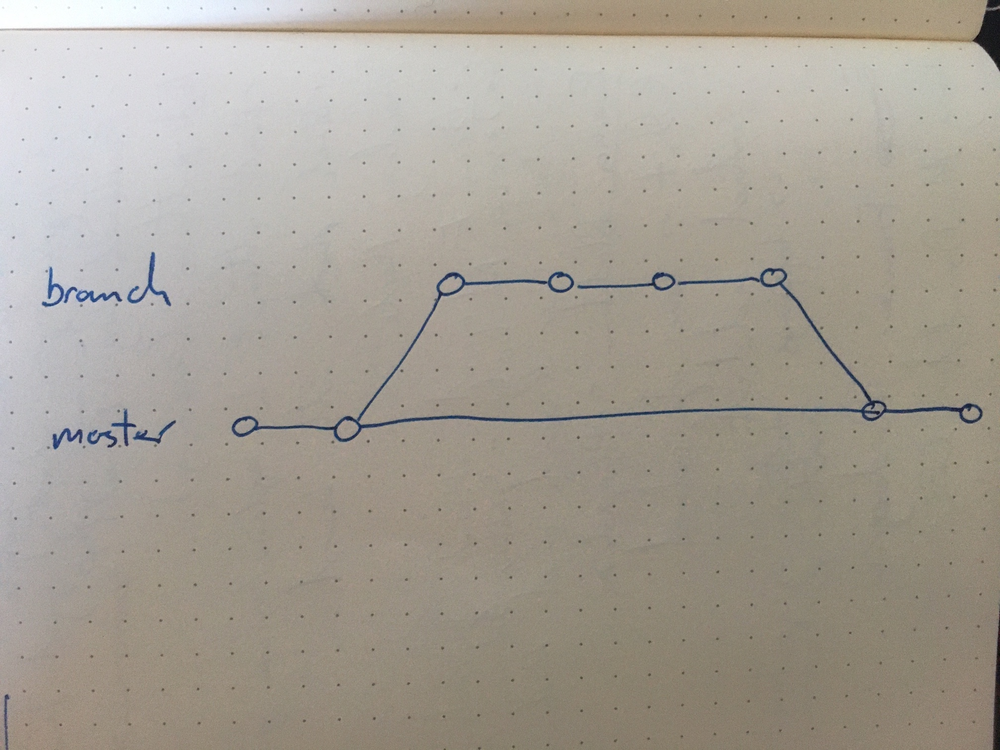

# Stop and Understand

## What is the purpose of source control?

Source control allows software teams to:

- _Keep track of and reverse changes_. As a project develops, new features will be implemented, bugs fixed and code refactored. Change is necessary but also risky, so it is important to know what changed, why it changed, when it was changed, and who made the change. Source control software allows us to do that, as well as reverse changes we don't want.

- _Work efficiently together_. With two or more developers working on the same project, there will naturally be areas of conflict and inefficiency. Source control software allows developers to collaborate effectively by preventing developers from stepping on each others' toes and providing workflows for managing collaboration.

- _Keep data safe_. Source control provides a way to back up code and data so it is not lost.

- _Continuous integration and deployment_. Source control is the first step in many continuous integration and deployment platforms: it allows us to create automated workflows for deploying our code to production.

## How does Git differ from other source control tools?

Git is a decentralised source control system, meaning each developer works on their own local copy of the repo, which is then merged with the `git push` command. By contrast, a centralised source control system (such as Subversion) requires every developer to work from a single repo on a centralised server.

Every command in a centralised system requires connection to the server (e.g. a centralised `commit` equivalent will add changes to the remote repo directly, whereas a decentralised system requies a `commit` to add to local repo and `push` to sync to remote)

Git (and other decentralised source control tools) provide several advantages over centralised tools:

- Doesn't require a connection to a centralised server to work. Developers can work offline or in areas with intermittent connectivity.

- Proposing changes to projects with pull requests is very easy.

- It's become the dominant source control system, such that there is a reasonable expectation that professional developers will know how to use it.

## Explain the Git tree visually

The Git tree represents the branches of source code versions, with nodes representing commits and edges representing the path between them.

For example, in the above image, `Jessica/project` is a branch that forks from the first commit in `Daniel/project`, which is then merged in the second commit on `Daniel/project`.

## Draw a Git tree that has 8 commits, where a branch was created off of the second commit and merged back in after 3 further commits

## Explain what the difference between `git pull` and `git fetch` is

`git fetch` = "bring my local copy of the remote repository up to date."

`git pull` = "bring the changes in the remote repository to where I keep my own code."

`git fetch` updates remote branches in your local repository from the latest versions in the remote repo (usualy `origin`). No merging with local branches takes place. `fetch` only touches files inside `.git/`; it doesn't touch the working tree. `git fetch` is useful if:

- You need to make sure you have an up-to-date copy of the repo locally (e.g. you're about to go on a flight / train) but you're not ready to merge with what you're working on.

- You want to manually manage the `merge` process if the thing you're working on might break.

`git pull` runs `git fetch` and then `git merge`, attempting to merge the newly `fetch`'d remote branches with your local branches. This can be useful if:

- You don't have anything in the working tree that might be inadvertently lost in a `git merge` (all code is committed).

- You want to save typing the two commands `git fetch` and `git merge` separately.

[This](https://longair.net/blog/2009/04/16/git-fetch-and-merge/) blog post argues to never use `git pull` and instead use `git fetch` and `git merge` separately.

## Draw and explain how `git merge` works compared to `git rebase`

`git merge` joins two or more branches together by creating a single merge commit with both histories on the current branch. This merge commit contains _all_ changes from _all_ commits wrapped in to one.

`git rebase` moves the point at which one branch diverges from another by plucking individual commits and placing them on top of the current branch.

- _Do_ use `merge` when you're working with someone else
- _Do_ use `rebase` when you want to keep a linear commit history.
- _Don't_ use `rebase` on a public/shared branch. (Danger!)

`merge` can result in a cluttered commit history with lots of 'Merge branch ...' messages.
